# Vivox Voice Integration

A **client side voice communication system** built using the Vivox SDK for Unreal Engine 5.

This system provides a structured and extensible way to manage:

* Voice login/session
* Multiple channel types (Echo / Non-Positional / Positional)
* Device management
* Transmission control

---

## Overview

This implementation wraps the Vivox SDK into a **UGameInstanceSubsystem** (`UVivoxSubSystem`) and **channel-level UObject abstraction** (`UVivoxChannelObject`).

It is designed for:

* Clean Blueprint integration
* Multi channel voice support
* Positional voice support (3D audio)

**Note**

* Settings for positional channel are inside plugin setting (ProjectSettings → Plugins → Vivox)  

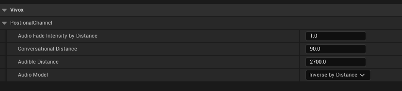

---

## 🧱 Architecture

```
GameInstance
   └── UVivoxSubSystem
            ├── Credentials
            ├── Login Session
            ├── Channel Management
            │
            └── UVivoxChannelObject
                     ├── Channel Session
                     ├── Audio Control
                     ├── Positional Updates
                     └── Speaking State
```

---

# 🔷 UVivoxSubSystem

## 📌 Responsibility

Central controller for:

* Vivox lifecycle (Init / Shutdown)
* User authentication
* Channel creation & tracking
* Audio device control
* Transmission mode


---

## 🔑 Credentials

### `SetVivoxCredentials(FVivoxCredentials VivoxCredentials)`

Sets required Vivox credentials.


**Note**

* Without valid credentials, Vivox will not function

---

### `GetVivoxCredentials()`


**Returns**
`FVivoxCredentials` – Current credentials

---

## ⚙️ Core Functions

### `InitializeVivox()`

Initializes the Vivox client and internal systems.


**Usage**

* Call once during game startup

---

### `UnInitializeVivox()`

Shuts down Vivox, releases resources and disconnectes from all changes and logs out.


**Usage**

* Call during game shutdown

---

## 🔐 Login System

### `Login(FString PlayerName,FOnVivoxLoggedIn OnLogin)`

Starts login process to Vivox server.

**Parameters**
* `Player Name` → Player name to login to vivox (Should not be empty or will not login to vivox)
* `OnLogin` → Callback triggered after login process completes

**Note**
* Call before creating vivox channels and using any voice channel related functionality 
* CreateAndJoinVoiceChannel function will only work after successfull login


---

### `Logout()`

Logs out from Vivox and clears session state.

**Behavior**

* Disconnects all channels
* Invalidates login session


---

# 🔊 Channel Management

---

### `CreateAndJoinVoiceChannel(...)`

```cpp
void CreateAndJoinVoiceChannel(
    FString ChannelSessionId,
    EVivoxChannelType ChannelType,
    FOnVivoxChannelJoined OnChannelJoined,
    UVivoxChannelObject*& ChannelObject,
    bool bConnectAudio = true,
    bool bTransmitAudio = true
);
```
Creates and joins a voice channel.

**Parameters**

* `ChannelSessionId` → Unique identifier for the channel
* `ChannelType` → Echo / NonPositional / Positional
* `OnChannelJoined` → Completion callback
* `ChannelObject` → Output reference of created channel
* `bConnectAudio` → Enables listening
* `bTransmitAudio` → Enables speaking

**Behavior**

* Stores channels in:

  * `EchoChannels`
  * `NonPostionalChannels`
  * `PositionalChannels`


---

### `GetAllChannelOfType(EVivoxChannelType ChannelType)`

* Gets all channel of provided type


**Returns**
`TArray<UVivoxChannelObject*>`

---

### `GetChannelOfType(EVivoxChannelType ChannelType, FString ChannelSessionId)`

* Gets channel of provided type based on ChannelSessionId (Will return null if channel of type contaning provided ChannelSessionId is not present)


**Returns**
`UVivoxChannelObject*`

---

# 🎧 Device Management

### `SetOutputDeviceVoiceState(EVivoxDeviceVoiceStatus Status)`

Mute / unmute output (speaker).

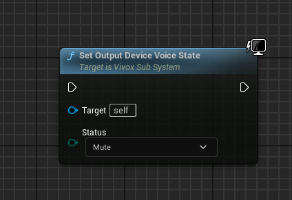

---

### `SetInputDeviceVoiceState(EVivoxDeviceVoiceStatus Status)`

Mute / unmute input (microphone).

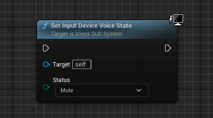

---

### `GetOutputDeviceVoiceState()`

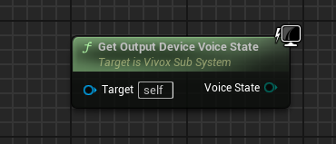

Returns output mute state.

---

### `GetInputDeviceVoiceState()`

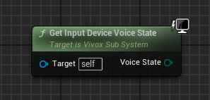

Returns input mute state.

---

### `SetOutputDeviceVolume(int32 Volume)`

**Range**: 0 – 100

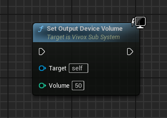

---

### `SetInputDeviceVolume(int32 Volume)`

**Range**: 0 – 100

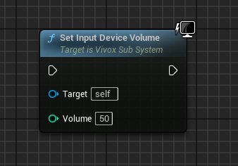

---

### `SetInputDeviceToNone()`

Stops audio capture.

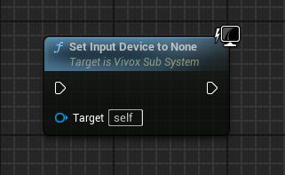

---

### `SetOutputDeviceToNone()`

Stops audio playback.

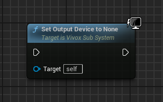

---

### `GetActiveInputDevice()`

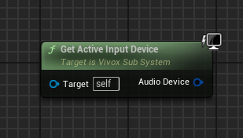

Returns current input device.

---

### `GetActiveOutputDevice()`

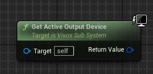

Returns current output device.

---

### `SetActiveInputDevice(FAudioDeviceData DeviceData)`

Sets microphone device.

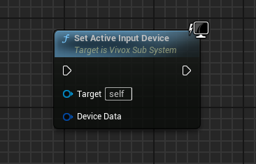

---

### `SetActiveOutputDevice(FAudioDeviceData DeviceData)`

Sets speaker device.

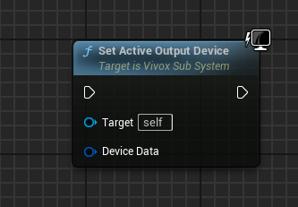

---

### `GetInputCommunicationDevice()`

Returns system communication input device.

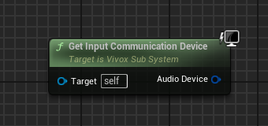

---

### `GetOutputCommunicationDevice()`

Returns system communication output device.

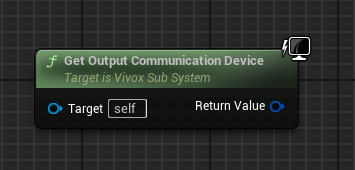

---

### `GetInputEffectiveDevice()`

Returns actual device used after resolution.


---

### `GetOutputEffectiveDevice()`

Returns actual output device used.

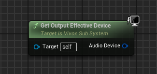

---

### `GetAvailableInputDevices()`

Returns all detected input devices.

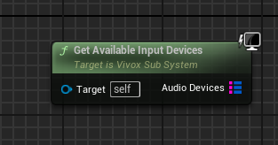

---

### `GetAvailableOutputDevices()`

Returns all detected output devices.

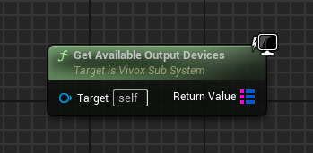

---

# 🎙️ Transmission Control

### `SetTransmissionToNone()`

Listen only mode (no speaking).

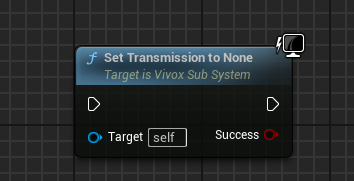

---

### `SetTransmissionToSingleChannel(UVivoxChannelObject* ChannelObject)`

Transmit only to one channel(provided channel).

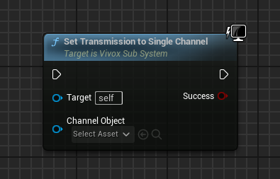

---

### `SetTransmissionToAll()`

Transmit to all joined channels.

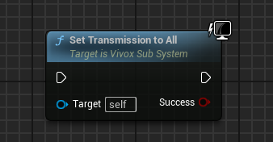

---

# 🔷 UVivoxChannelObject

## 📌 Responsibility

Represents a **single voice channel instance**.

Handles:

* Channel connection
* Audio routing
* Positional updates
* Speaking detection

---

## 🔑 Core Functions

### `GetChannelSessionId()`

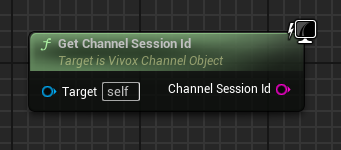

Returns channel identifier string.

---

### `GetChannelConnectionState()`

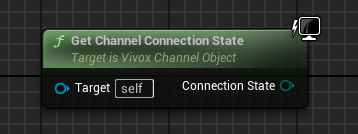

Returns Vivox connection state.

---

### `SetAudioConnected(bool bListenAudio, bool bTransmitAudio)`

Controls listening and speaking state.

**Behavior**

* Can override Vivox transmission mode
* Disabling audio resets transmission

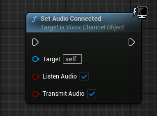

---

### `LeaveChannel()`

Leaves channel and destroys object.

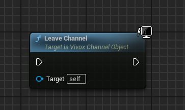

---

# 🌍 Positional Voice (3D Audio)

### `UpdateVivox3dPosition(...)`

```cpp
void UpdateVivox3dPosition(
    const FVector& position,
    const FVector& ForwardVector,
    const FVector& UpVector
);
```

Updates 3D spatial position for positional channel.

**Usage**

* Call every tick (or when movement changes)
* Uses cached dirty system for optimization

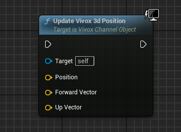

---

# 🗣️ Speaking Detection

### `IsSpeakingToChannel(double& AudioEnergy)`

Checks if user is currently speaking.

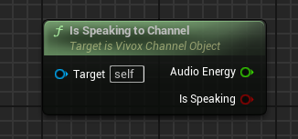

