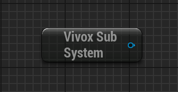
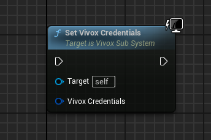
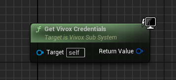
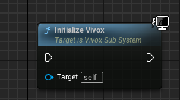
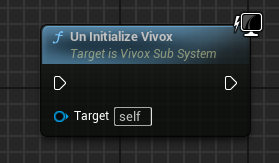
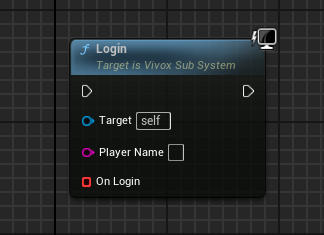
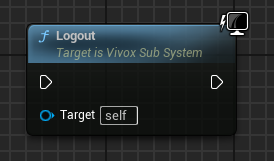
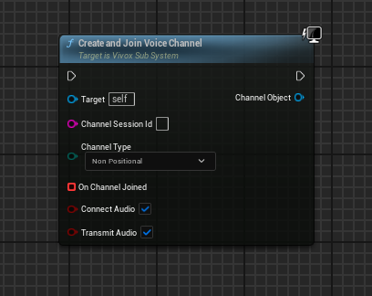
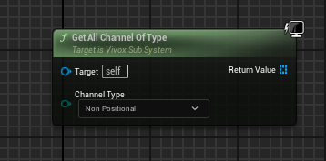
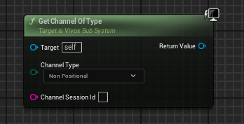

# 🎤 Vivox Voice Integration (UE5 – Client Side)

A **client-side voice communication system** built using the Vivox SDK for Unreal Engine 5.

This system provides a structured and extensible way to manage:

* Voice login/session
* Multiple channel types (Echo / Non-Positional / Positional)
* Device management
* Transmission control

---

## 📖 Overview

This implementation wraps the Vivox SDK into a **UGameInstanceSubsystem** (`UVivoxSubSystem`) and **channel-level UObject abstraction** (`UVivoxChannelObject`).

It is designed for:

* Clean Blueprint integration
* Multi-channel voice support
* Positional voice support (3D audio)
* Full device control

---

## 🧱 Architecture

```
GameInstance
   └── UVivoxSubSystem
            ├── Credentials
            ├── Login Session
            ├── Channel Management
            │
            └── UVivoxChannelObject
                     ├── Channel Session
                     ├── Audio Control
                     ├── Positional Updates
                     └── Speaking State
```

---

# 🔷 UVivoxSubSystem

## 📌 Responsibility

Central controller for:

* Vivox lifecycle (Init / Shutdown)
* User authentication
* Channel creation & tracking
* Audio device control
* Transmission mode



---

## 🔑 Credentials

### `SetVivoxCredentials(FVivoxCredentials VivoxCredentials)`

Sets required Vivox credentials.



**Note**

* Without valid credentials, Vivox will not function

---

### `GetVivoxCredentials()`



**Returns**
`FVivoxCredentials` – Current credentials

---

## ⚙️ Core Functions

---

### `InitializeVivox()`

Initializes the Vivox client and internal systems.



**Usage**

* Call once during game startup

---

### `UnInitializeVivox()`

Shuts down Vivox, releases resources and disconnectes from all changes and logs out.



**Usage**

* Call during game shutdown

---

## 🔐 Login System

---

### `Login(FString PlayerName,FOnVivoxLoggedIn OnLogin)`

Starts login process to Vivox server.

**Parameters**
* `Player Name` → Player name to login to vivox (Should not be empty or will not login to vivox)
* `OnLogin` → Callback triggered after login process completes

**Note**
* Call before creating vivox channels and using any voice channel related functionality 
* CreateAndJoinVoiceChannel function will only work after successfull login



---

### `Logout()`

Logs out from Vivox and clears session state.

**Behavior**

* Disconnects all channels
* Invalidates login session



---

# 🔊 Channel Management

---

### `CreateAndJoinVoiceChannel(...)`

```cpp
void CreateAndJoinVoiceChannel(
    FString ChannelSessionId,
    EVivoxChannelType ChannelType,
    FOnVivoxChannelJoined OnChannelJoined,
    UVivoxChannelObject*& ChannelObject,
    bool bConnectAudio = true,
    bool bTransmitAudio = true
);
```
Creates and joins a voice channel.

**Parameters**

* `ChannelSessionId` → Unique identifier for the channel
* `ChannelType` → Echo / NonPositional / Positional
* `OnChannelJoined` → Completion callback
* `ChannelObject` → Output reference of created channel
* `bConnectAudio` → Enables listening
* `bTransmitAudio` → Enables speaking

**Behavior**

* Stores channels in:

  * `EchoChannels`
  * `NonPostionalChannels`
  * `PositionalChannels`



---

### `GetAllChannelOfType(EVivoxChannelType ChannelType)`

* Gets all channel of provided type

**Returns**
`TArray<UVivoxChannelObject*>`



---

### `GetChannelOfType(EVivoxChannelType ChannelType, FString ChannelSessionId)`

* Gets channel of provided type based on ChannelSessionId (Will return null if channel of type contaning provided ChannelSessionId is not present)

**Returns**
`UVivoxChannelObject*`



---

# 🎧 Device Management

---

### `SetOutputDeviceVoiceState(EVivoxDeviceVoiceStatus Status)`

Mute / unmute output (speaker).

---

### `SetInputDeviceVoiceState(EVivoxDeviceVoiceStatus Status)`

Mute / unmute input (microphone).

---

### `GetOutputDeviceVoiceState()`

Returns output mute state.

---

### `GetInputDeviceVoiceState()`

Returns input mute state.

---

### `SetOutputDeviceVolume(int32 Volume)`

**Range**: 0 – 100

---

### `SetInputDeviceVolume(int32 Volume)`

**Range**: 0 – 100

---

### `SetInputDeviceToNone()`

Stops audio capture.

---

### `SetOutputDeviceToNone()`

Stops audio playback.

---

### `GetActiveInputDevice()`

Returns current input device.

---

### `GetActiveOutputDevice()`

Returns current output device.

---

### `SetActiveInputDevice(FAudioDeviceData DeviceData)`

Sets microphone device.

---

### `SetActiveOutputDevice(FAudioDeviceData DeviceData)`

Sets speaker device.

---

### `GetInputCommunicationDevice()`

Returns system communication input device.

---

### `GetOutputCommunicationDevice()`

Returns system communication output device.

---

### `GetInputEffectiveDevice()`

Returns actual device used after resolution.

---

### `GetOutputEffectiveDevice()`

Returns actual output device used.

---

### `GetAvailableInputDevices()`

Returns all detected input devices.

---

### `GetAvailableOutputDevices()`

Returns all detected output devices.

---

# 🎙️ Transmission Control

---

### `SetTransmissionToNone()`

**Description**
Listen-only mode (no speaking).

---

### `SetTransmissionToSingleChannel(UVivoxChannelObject* ChannelObject)`

**Description**
Transmit only to one channel.

---

### `SetTransmissionToAll()`

**Description**
Transmit to all joined channels.

---

# 🔷 UVivoxChannelObject

## 📌 Responsibility

Represents a **single voice channel instance**.

Handles:

* Channel connection
* Audio routing
* Positional updates
* Speaking detection

---

## 🔑 Core Functions

---

### `GetChannel()`

Returns internal `ChannelId`.

---

### `GetChannelSessionId()`

Returns channel identifier string.

---

### `GetChannelConnectionState()`

Returns Vivox connection state.

---

### `SetAudioConnected(bool bListenAudio, bool bTransmitAudio)`

**Description**
Controls listening and speaking state.

**Behavior**

* Can override Vivox transmission mode
* Disabling audio resets transmission

---

### `JoinChannel(...)`

Internal join logic.

**Parameters**

* ChannelId
* ChannelType
* Callback
* Audio flags

---

### `LeaveChannel()`

Leaves channel and destroys object.

---

# 🌍 Positional Voice (3D Audio)

---

### `UpdateVivox3dPosition(...)`

```cpp
void UpdateVivox3dPosition(
    const FVector& position,
    const FVector& ForwardVector,
    const FVector& UpVector
);
```

**Description**
Updates 3D spatial position for positional channels.

**Usage**

* Call every tick (or when movement changes)
* Uses cached dirty system for optimization

---

### `Get3DValuesAreDirty()`

Returns whether transform changed.

---

### `Clear3DValuesAreDirty()`

Resets dirty state.

---

# 🗣️ Speaking Detection

---

### `IsSpeakingToChannel(double& AudioEnergy)`

**Description**
Checks if user is currently speaking.

**Returns**

* `bool` → Speaking state
* `AudioEnergy` → Voice intensity

---

# 🖼️ Screenshots

```
Images/
 ├── voice_ui.png
 ├── positional_debug.png
 └── device_settings.png
```

---

# ⚙️ Setup

1. Enable Vivox plugin
2. Add dependency:

```cpp
PublicDependencyModuleNames.AddRange(new string[] { "VivoxCore" });
```

3. Wrap code:

```cpp
#if WITH_VIVOX
```

---

# 💻 Example Usage

```cpp
Vivox->SetVivoxCredentials(Creds);
Vivox->InitializeVivox();

Vivox->Login(OnLogin);

Vivox->CreateAndJoinVoiceChannel(
    "Global",
    EVivoxChannelType::NonPositional,
    OnJoined,
    Channel,
    true,
    true
);
```

---

# 📈 Future Extensions

* Player mute system
* UI voice indicators
* Channel priority
* Push-to-talk system

---

# 📄 License

© 2025 SPD78
